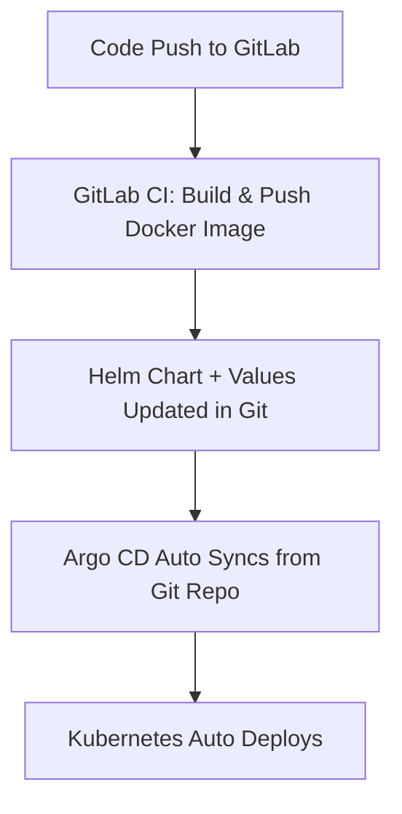

# GitOps-Based-Microservices-Deployment-on-Kubernetes

Sure! Here's the full **`README.md`** in markdown format for your GitHub repository:

```markdown
# 🚀 GitOps-Based Microservices Deployment on Kubernetes

Deploy a multi-service Node.js application using **GitLab CI** for automation and **Argo CD** for GitOps-based deployment on Kubernetes.

---

## ✅ Project Objective

- Build Docker images with **GitLab CI**
- Create and manage Kubernetes manifests with **Helm**
- Store all configurations in **Git** for GitOps
- Automate deployments using **Argo CD**
- Use **EKS** or **GKE** as the target Kubernetes cluster

---

## 🧱 Project Structure

```plain test
gitops-nodejs-microservices/
├── microservices/
│   ├── user-service/
│   │   ├── app.js
│   │   ├── Dockerfile
│   │   ├── package.json
│   │   └── helm/
│   │       ├── Chart.yaml
│   │       ├── values.yaml
│   │       └── templates/
│   │           ├── deployment.yaml
│   │           └── service.yaml
│   └── order-service/
│       └── ... (same structure as user-service)
├── manifests/
│   └── argo-apps/
│       ├── user-service.yaml
│       └── order-service.yaml
├── .gitlab-ci.yml
└── README.md
```

---

## 🛠️ Technologies Used

- Kubernetes (EKS or GKE)
- Docker
- GitLab CI/CD
- Argo CD
- GitOps practices
- Helm

---

## 🔧 Step-by-Step Setup

### Step 1: Provision Kubernetes Cluster

#### For EKS:
```bash
eksctl create cluster --name gitops-cluster --region us-east-1 --nodes 2
aws eks --region us-east-1 update-kubeconfig --name gitops-cluster
```

#### For GKE:
```bash
gcloud container clusters create gitops-cluster \
  --num-nodes=2 --zone=us-central1-a
gcloud container clusters get-credentials gitops-cluster --zone us-central1-a
```

---

### Step 2: Install Argo CD

```bash
kubectl create namespace argocd

kubectl apply -n argocd -f https://raw.githubusercontent.com/argoproj/argo-cd/stable/manifests/install.yaml

kubectl port-forward svc/argocd-server -n argocd 8080:443
```

Login credentials:
```bash
kubectl get secret argocd-initial-admin-secret -n argocd \
  -o jsonpath="{.data.password}" | base64 -d
```

---

### Step 3: Dockerize Microservices

**Example Dockerfile (user-service):**
```Dockerfile
FROM node:18-alpine
WORKDIR /app
COPY package*.json ./
RUN npm install
COPY . .
CMD ["node", "app.js"]
```

---

### Step 4: Helm Charts for Microservices

**Chart.yaml**
```yaml
apiVersion: v2
name: user-service
version: 0.1.0
```

**values.yaml**
```yaml
name: user-service
image:
  repository: registry.gitlab.com/your-username/user-service
  tag: latest
```

**deployment.yaml**
```yaml
apiVersion: apps/v1
kind: Deployment
metadata:
  name: {{ .Values.name }}
spec:
  replicas: 1
  selector:
    matchLabels:
      app: {{ .Values.name }}
  template:
    metadata:
      labels:
        app: {{ .Values.name }}
    spec:
      containers:
        - name: {{ .Values.name }}
          image: "{{ .Values.image.repository }}:{{ .Values.image.tag }}"
          ports:
            - containerPort: 3000
```

**service.yaml**
```yaml
apiVersion: v1
kind: Service
metadata:
  name: {{ .Values.name }}
spec:
  selector:
    app: {{ .Values.name }}
  ports:
    - port: 80
      targetPort: 3000
```

---

### Step 5: GitLab CI Configuration

**.gitlab-ci.yml**
```yaml
stages:
  - build
  - deploy

variables:
  IMAGE_TAG: "latest"

build:
  stage: build
  script:
    - docker build -t registry.gitlab.com/your-username/user-service:$IMAGE_TAG .
    - echo "$CI_JOB_TOKEN" | docker login -u "$CI_REGISTRY_USER" --password-stdin $CI_REGISTRY
    - docker push registry.gitlab.com/your-username/user-service:$IMAGE_TAG

deploy:
  stage: deploy
  script:
    - echo "Handled by Argo CD GitOps automation"
```

---

### Step 6: Argo CD Application Manifest

**user-service.yaml**
```yaml
apiVersion: argoproj.io/v1alpha1
kind: Application
metadata:
  name: user-service
  namespace: argocd
spec:
  project: default
  source:
    repoURL: 'https://gitlab.com/your-username/gitops-nodejs-microservices'
    targetRevision: HEAD
    path: microservices/user-service/helm
  destination:
    server: 'https://kubernetes.default.svc'
    namespace: default
  syncPolicy:
    automated:
      prune: true
      selfHeal: true
```

Deploy it:
```bash
kubectl apply -f manifests/argo-apps/user-service.yaml
```

---

## 🔄 GitOps Workflow



---

## 📦 Outcome

✅ Microservices deployed using CI/CD  
✅ Kubernetes Helm-based manifests  
✅ GitOps workflow for reliability and auditability  
✅ Easily scalable and observable setup

---

## 📌 Author

**Liliane Konissi**  
GitLab: [@your-username](https://gitlab.com/your-username)  
YouTube | Medium | LinkedIn (add relevant links)

---

## 📝 License

This project is licensed under the MIT License.
```

Let me know if you'd like a downloadable `README.md` file or want to scaffold this repo automatically via a Python script!
