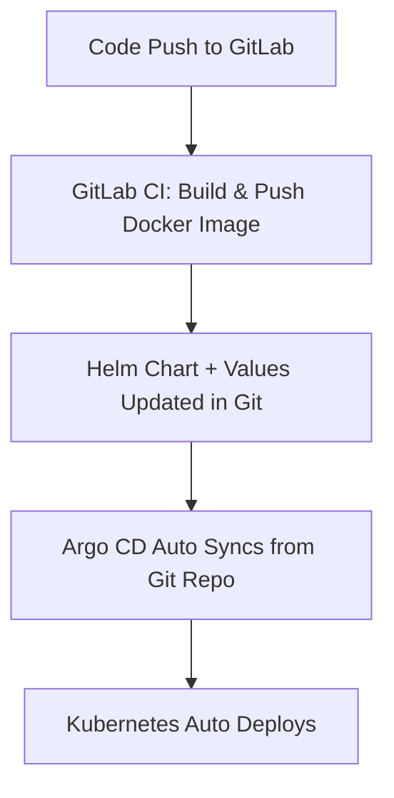

# GitOps-Based-Microservices-Deployment-on-Kubernetes

Sure! Here's the full **`README.md`** in markdown format for your GitHub repository:

```markdown
# 🚀 GitOps-Based Microservices Deployment on Kubernetes

Deploy a multi-service Node.js application using **GitLab CI** for automation and **Argo CD** for GitOps-based deployment on Kubernetes.

---

## ✅ Project Objective

- Build Docker images with **GitLab CI**
- Create and manage Kubernetes manifests with **Helm**
- Store all configurations in **Git** for GitOps
- Automate deployments using **Argo CD**
- Use **EKS** or **GKE** as the target Kubernetes cluster

---

## 🧱 Project Structure

```Plain Text
gitops-nodejs-microservices/
├── microservices/
│   ├── user-service/
│   │   ├── app.js
│   │   ├── Dockerfile
│   │   ├── package.json
│   │   └── helm/
│   │       ├── Chart.yaml
│   │       ├── values.yaml
│   │       └── templates/
│   │           ├── deployment.yaml
│   │           └── service.yaml
│   └── order-service/
│       └── ... (same structure as user-service)
├── manifests/
│   └── argo-apps/
│       ├── user-service.yaml
│       └── order-service.yaml
├── .gitlab-ci.yml
└── README.md
```
#### file-setup.py


```python
import os

# Base path
base_path = "/home/lilia/VIDEOS/gitops-nodejs-microservices"

# File structure and content
tree = {
    "microservices/user-service/app.js": """const express = require('express');\nconst app = express();\n\napp.get('/', (req, res) => res.send('User Service Running!'));\n\napp.listen(3000, () => console.log('User service listening on port 3000!'));\n""",

    "microservices/user-service/Dockerfile": """FROM node:18-alpine\nWORKDIR /app\nCOPY package*.json ./\nRUN npm install\nCOPY . .\nCMD [\"node\", \"app.js\"]\n""",

    "microservices/user-service/package.json": """{\n  \"name\": \"user-service\",\n  \"version\": \"1.0.0\",\n  \"main\": \"app.js\",\n  \"dependencies\": {\n    \"express\": \"^4.18.2\"\n  }\n}\n""",

    "microservices/user-service/helm/Chart.yaml": """apiVersion: v2\nname: user-service\nversion: 0.1.0\n""",

    "microservices/user-service/helm/values.yaml": """name: user-service\nimage:\n  repository: registry.gitlab.com/your-username/user-service\n  tag: latest\n""",

    "microservices/user-service/helm/templates/deployment.yaml": """apiVersion: apps/v1\nkind: Deployment\nmetadata:\n  name: {{ .Values.name }}\nspec:\n  replicas: 1\n  selector:\n    matchLabels:\n      app: {{ .Values.name }}\n  template:\n    metadata:\n      labels:\n        app: {{ .Values.name }}\n    spec:\n      containers:\n        - name: {{ .Values.name }}\n          image: \"{{ .Values.image.repository }}:{{ .Values.image.tag }}\"\n          ports:\n            - containerPort: 3000\n""",

    "microservices/user-service/helm/templates/service.yaml": """apiVersion: v1\nkind: Service\nmetadata:\n  name: {{ .Values.name }}\nspec:\n  selector:\n    app: {{ .Values.name }}\n  ports:\n    - port: 80\n      targetPort: 3000\n""",

    "microservices/order-service/app.js": """const express = require('express');\nconst app = express();\n\napp.get('/', (req, res) => res.send('Order Service Running!'));\n\napp.listen(3001, () => console.log('Order service listening on port 3001!'));\n""",

    "microservices/order-service/Dockerfile": """FROM node:18-alpine\nWORKDIR /app\nCOPY package*.json ./\nRUN npm install\nCOPY . .\nCMD [\"node\", \"app.js\"]\n""",

    "microservices/order-service/package.json": """{\n  \"name\": \"order-service\",\n  \"version\": \"1.0.0\",\n  \"main\": \"app.js\",\n  \"dependencies\": {\n    \"express\": \"^4.18.2\"\n  }\n}\n""",

    "microservices/order-service/helm/Chart.yaml": """apiVersion: v2\nname: order-service\nversion: 0.1.0\n""",

    "microservices/order-service/helm/values.yaml": """name: order-service\nimage:\n  repository: registry.gitlab.com/your-username/order-service\n  tag: latest\n""",

    "microservices/order-service/helm/templates/deployment.yaml": """apiVersion: apps/v1\nkind: Deployment\nmetadata:\n  name: {{ .Values.name }}\nspec:\n  replicas: 1\n  selector:\n    matchLabels:\n      app: {{ .Values.name }}\n  template:\n    metadata:\n      labels:\n        app: {{ .Values.name }}\n    spec:\n      containers:\n        - name: {{ .Values.name }}\n          image: \"{{ .Values.image.repository }}:{{ .Values.image.tag }}\"\n          ports:\n            - containerPort: 3000\n""",

    "microservices/order-service/helm/templates/service.yaml": """apiVersion: v1\nkind: Service\nmetadata:\n  name: {{ .Values.name }}\nspec:\n  selector:\n    app: {{ .Values.name }}\n  ports:\n    - port: 80\n      targetPort: 3000\n""",

    "manifests/argo-apps/user-service.yaml": """apiVersion: argoproj.io/v1alpha1\nkind: Application\nmetadata:\n  name: user-service\n  namespace: argocd\nspec:\n  project: default\n  source:\n    repoURL: 'https://gitlab.com/your-username/gitops-nodejs-microservices'\n    targetRevision: HEAD\n    path: microservices/user-service/helm\n  destination:\n    server: 'https://kubernetes.default.svc'\n    namespace: default\n  syncPolicy:\n    automated:\n      prune: true\n      selfHeal: true\n""",

    "manifests/argo-apps/order-service.yaml": """apiVersion: argoproj.io/v1alpha1\nkind: Application\nmetadata:\n  name: order-service\n  namespace: argocd\nspec:\n  project: default\n  source:\n    repoURL: 'https://gitlab.com/your-username/gitops-nodejs-microservices'\n    targetRevision: HEAD\n    path: microservices/order-service/helm\n  destination:\n    server: 'https://kubernetes.default.svc'\n    namespace: default\n  syncPolicy:\n    automated:\n      prune: true\n      selfHeal: true\n""",

    ".gitlab-ci.yml": """stages:\n  - build\n  - deploy\n\nvariables:\n  IMAGE_TAG: \"latest\"\n\nbuild_user_service:\n  stage: build\n  script:\n    - docker build -t $CI_REGISTRY_IMAGE/user-service:$IMAGE_TAG ./microservices/user-service\n    - echo \"$CI_JOB_TOKEN\" | docker login -u \"$CI_REGISTRY_USER\" --password-stdin $CI_REGISTRY\n    - docker push $CI_REGISTRY_IMAGE/user-service:$IMAGE_TAG\n\nbuild_order_service:\n  stage: build\n  script:\n    - docker build -t $CI_REGISTRY_IMAGE/order-service:$IMAGE_TAG ./microservices/order-service\n    - echo \"$CI_JOB_TOKEN\" | docker login -u \"$CI_REGISTRY_USER\" --password-stdin $CI_REGISTRY\n    - docker push $CI_REGISTRY_IMAGE/order-service:$IMAGE_TAG\n\ndeploy:\n  stage: deploy\n  script:\n    - echo \"Deployment is handled by Argo CD auto-sync.\"\n"""
}

# Create files
for relative_path, content in tree.items():
    full_path = os.path.join(base_path, relative_path)
    os.makedirs(os.path.dirname(full_path), exist_ok=True)
    with open(full_path, "w") as f:
        f.write(content)

print("✅ Project files created successfully!")

```

---

## 🛠️ Technologies Used

- Kubernetes (EKS or GKE)
- Docker
- GitLab CI/CD
- Argo CD
- GitOps practices
- Helm

---
## How to use GitLab for this project:

```plain text

1. Create a GitLab Repository
Project Name: gitops-nodejs-microservices
Visibility: Private or Public (your choice)
✅ Result: Git is your source of truth. Argo CD will watch this repo!

2. Set Up GitLab Container Registry
Every GitLab project automatically gets a free container registry.
You can push Docker images like:  
registry.gitlab.com/your-username/gitops-nodejs-microservices/user-service:latest  

Push them into GitLab's own registry using $CI_REGISTRY  

3. Configure GitLab CI/CD
Create a file called .gitlab-ci.yml at the root of your repository.
Every push to GitLab triggers:
 - Docker image build
 - Image push to GitLab registry
 - Argo CD sees the new Helm chart (or values.yaml) version → deploys to Kubernetes automatically!
```
---


## Pro Tip: Use GitLab Environment Variables  
```plain text
Go to:  
GitLab → Project → Settings → CI/CD → Variables  
Add:  
 - CI_REGISTRY_USER → your GitLab username  
 - CI_REGISTRY_PASSWORD → your GitLab password or CI Job Token (default works)  
 - CI_REGISTRY → automatically set by GitLab 
 - Optional: if using Kubernetes configs, you could store KUBE_CONFIG as well!  
```
---
---

## 🔧 Step-by-Step Setup

### Step 1: Provision Kubernetes Cluster
👉 To create the infrastructure (Kubernetes Cluster) where your Node.js microservices will run.  
Why:
 - You need a Kubernetes cluster to deploy your containerized apps.
 - We use EKS (AWS) or GKE (Google Cloud) because they manage the Kubernetes control plane for you (easier and production-ready).


#### For EKS:
```bash
eksctl create cluster --name gitops-cluster --region us-east-1 --nodes 2
aws eks --region us-east-1 update-kubeconfig --name gitops-cluster
```

#### For GKE:
```bash
gcloud container clusters create gitops-cluster \
  --num-nodes=2 --zone=us-central1-a
gcloud container clusters get-credentials gitops-cluster --zone us-central1-a
```

---

### Step 2: Install Argo CD
👉 To install Argo CD into the Kubernetes cluster so that it can watch your Git repository and automatically deploy changes.  
Why:  
 - Argo CD enables GitOps: it syncs your Kubernetes manifests (Helm charts, Kustomize, YAML) directly from Git to your cluster.
 - It automates deployment, rollback, and monitoring.


```bash
kubectl create namespace argocd

kubectl apply -n argocd -f https://raw.githubusercontent.com/argoproj/argo-cd/stable/manifests/install.yaml

kubectl port-forward svc/argocd-server -n argocd 8080:443
```

Login credentials:
```bash
kubectl get secret argocd-initial-admin-secret -n argocd \
  -o jsonpath="{.data.password}" | base64 -d
```

---

### Step 3: Dockerize Microservices

👉 To create Docker images for each microservice so that they can run as containers inside Kubernetes.  
Why:
 - Kubernetes deploys containers — not raw source code.
 - Docker images package your app code, dependencies, and runtime environment together.

**Example Dockerfile (user-service):**
```Dockerfile
FROM node:18-alpine
WORKDIR /app
COPY package*.json ./
RUN npm install
COPY . .
CMD ["node", "app.js"]
```

---

### Step 4: Helm Charts for Microservices

👉 To create Helm charts that define how each microservice will be deployed to Kubernetes.
Why:
- Helm is a templating engine for Kubernetes YAML.
 - It makes deployments reusable, customizable (via values.yaml), and easier to manage than raw YAML.

**Chart.yaml**
```yaml
apiVersion: v2
name: user-service
version: 0.1.0
```

**values.yaml**
```yaml
name: user-service
image:
  repository: registry.gitlab.com/your-username/user-service
  tag: latest
```

**deployment.yaml**
```yaml
apiVersion: apps/v1
kind: Deployment
metadata:
  name: {{ .Values.name }}
spec:
  replicas: 1
  selector:
    matchLabels:
      app: {{ .Values.name }}
  template:
    metadata:
      labels:
        app: {{ .Values.name }}
    spec:
      containers:
        - name: {{ .Values.name }}
          image: "{{ .Values.image.repository }}:{{ .Values.image.tag }}"
          ports:
            - containerPort: 3000
```

**service.yaml**
```yaml
apiVersion: v1
kind: Service
metadata:
  name: {{ .Values.name }}
spec:
  selector:
    app: {{ .Values.name }}
  ports:
    - port: 80
      targetPort: 3000
```

---

### Step 5: GitLab CI Configuration

👉 To set up a GitLab CI pipeline that automatically:
 - Builds Docker images
 - Pushes them to a container registry (GitLab Registry)
Why:  
 - Every time you push changes to Git, your pipeline builds and updates your images automatically.
 - It reduces manual work and human errors.

**.gitlab-ci.yml**
```yaml
stages:
  - build
  - deploy

variables:
  IMAGE_TAG: "latest"

build:
  stage: build
  script:
    - docker build -t registry.gitlab.com/your-username/user-service:$IMAGE_TAG .
    - echo "$CI_JOB_TOKEN" | docker login -u "$CI_REGISTRY_USER" --password-stdin $CI_REGISTRY
    - docker push registry.gitlab.com/your-username/user-service:$IMAGE_TAG

deploy:
  stage: deploy
  script:
    - echo "Handled by Argo CD GitOps automation"
```

---

### Step 6: Argo CD Application Manifest

👉 To define an Argo CD Application object that links your Git repository to your Kubernetes cluster.  
Why:  
 - Argo CD needs to know which repo, which branch, and which path it should sync from.
 - Once defined, Argo CD keeps your Kubernetes cluster in sync with the state stored in Git.

**user-service.yaml**
```yaml
apiVersion: argoproj.io/v1alpha1
kind: Application
metadata:
  name: user-service
  namespace: argocd
spec:
  project: default
  source:
    repoURL: 'https://gitlab.com/your-username/gitops-nodejs-microservices'
    targetRevision: HEAD
    path: microservices/user-service/helm
  destination:
    server: 'https://kubernetes.default.svc'
    namespace: default
  syncPolicy:
    automated:
      prune: true
      selfHeal: true
```

Deploy it:
```bash
kubectl apply -f manifests/argo-apps/user-service.yaml
```

---

## 🔄 GitOps Workflow



---

## 📦 Outcome

✅ Microservices deployed using CI/CD  
✅ Kubernetes Helm-based manifests  
✅ GitOps workflow for reliability and auditability  
✅ Easily scalable and observable setup

---

## 📌 Author

**Liliane Konissi**  
GitLab: [@your-username](https://gitlab.com/your-username)  
YouTube | Medium | LinkedIn (add relevant links)

---

## 📝 License

This project is licensed under the MIT License.
```

Let me know if you'd like a downloadable `README.md` file or want to scaffold this repo automatically via a Python script!
